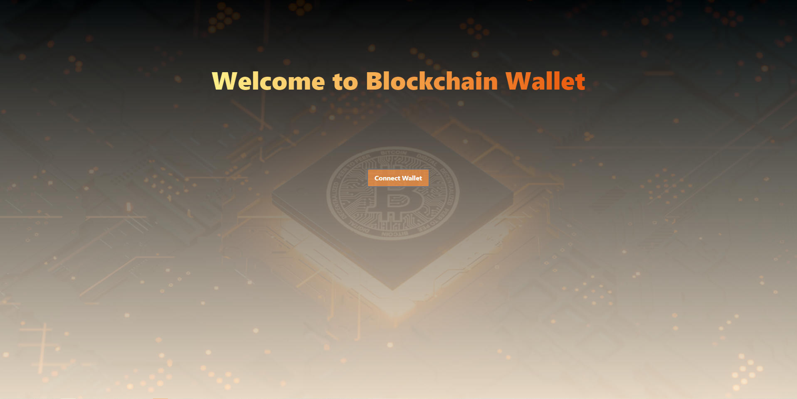
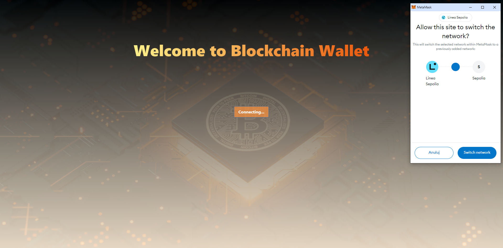
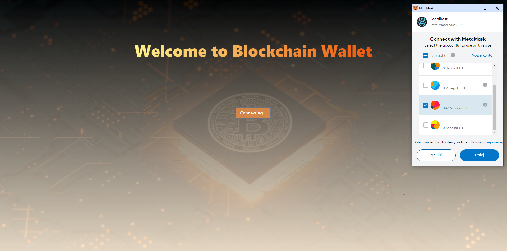
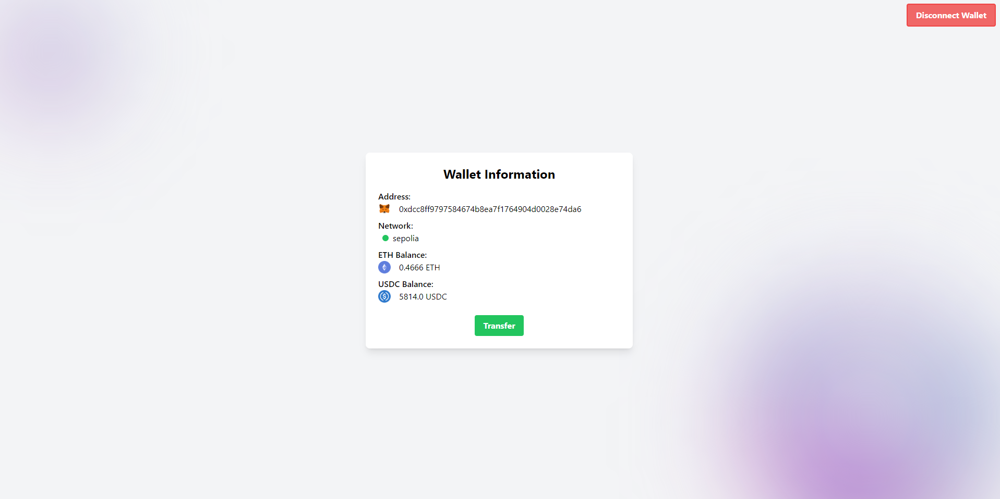
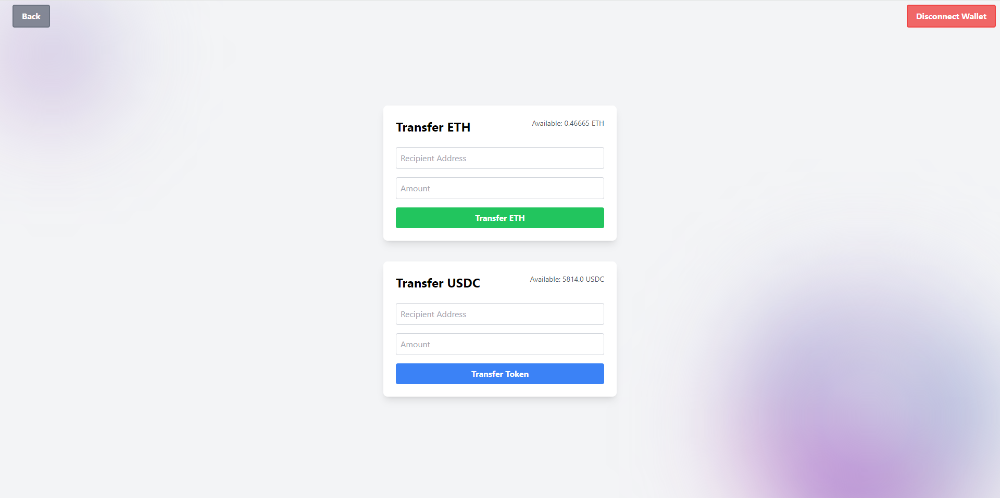
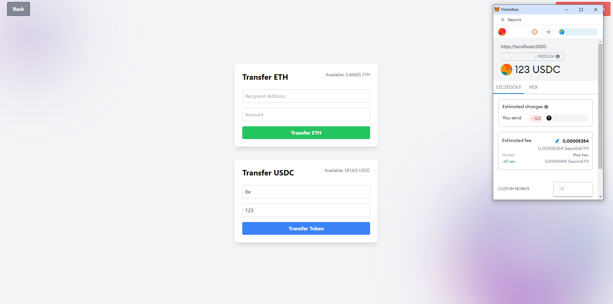
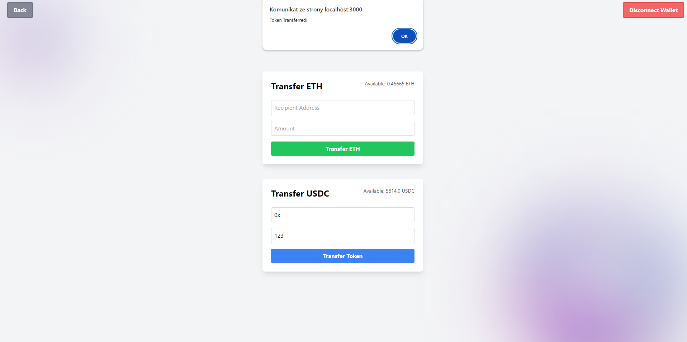

# Blockchain Wallet

Blockchain Wallet is a decentralized application (dApp) that allows users to manage and transfer Ethereum and ERC-20 token (USDC). Built with React and TypeScript, it integrates withetaMask for wallet interactions and uses Redux for state management.

## Technologies

- **Implementation in React:** The user interface is built using React to provide a dynamic and responsive experience.
- **Using Redux Toolkit:** State management is handled using Redux Toolkit to efficiently manage application state.
- **Tailwind CSS:** The application uses Tailwind CSS for styling and layout, providing a clean and customizable design.
- **Ethers.js:** Communication with the Ethereum blockchain is facilitated using Ethers.js.
- **TypeScript:** TypeScript is used to add type safety and improve code quality.

## Features

- **Connect to MetaMask:** Seamlessly connect your MetaMask wallet to the app.
- **Switch Networks:** Automatically switch to the Sepolia test network.
- **Transfer ETH:** Send Ether to other Ethereum addresses.
- **Transfer ERC-20 Token:** Send ERC-20 token such as USDC to other addresses.
- **View Balances:** Check balances for ETH and ERC-20 token.
- **Disconnect Wallet:** Revoke wallet permissions and disconnect from the app.

## Prerequisites

- Node.js (v14 or higher)
- npm or yarn
- MetaMask installed in your browser

## Installation

1. **Clone the repository:**

   ```bash
   git clone https://github.com/reri101/blockchain-wallet.git
   cd blockchain-wallet
   ```

2. **Install dependencies:**

   Using npm:

   ```bash
   npm install
   ```

   Using yarn:

   ```bash
   yarn install
   ```

3. **Run the application:**

   Using npm:

   ```bash
   npm start
   ```

   Using yarn:

   ```bash
   yarn start
   ```

   This will start the development server and open the application in your default web browser.

## Usage

1. **Connecting Wallet:**

   - Click the \"Connect Wallet\" button to connect your MetaMask wallet.
   - The app will automatically switch to the Sepolia test network if needed.

2. **Viewing Wallet Information:**

   - Navigate to the \"Wallet Information\" section to view your connected wallet's details.
   - The section displays your wallet address, current network, ETH balance, and USDC balance.
   - You can disconnect your wallet from this section if needed by clicking the \"Disconnect Wallet\" button.
   - If no wallet is connected, a prompt will instruct you to connect your wallet.

3. **Transferring ETH:**

   - Navigate to the \"Transfer ETH\" section.
   - Enter the recipient address and amount of ETH to transfer.
   - Click \"Transfer ETH\" to complete the transaction.

4. **Transferring ERC-20 Token:**

   - Navigate to the \"Transfer USDC\" section.
   - Enter the token contract address, recipient address, and amount of tokens to transfer.
   - Click \"Transfer Token\" to complete the transaction.

5. **Disconnecting Wallet:**
   - Click the \"Disconnect Wallet\" button to revoke permissions and disconnect from MetaMask.

## Configuration

Update the following constants in `src/ethereum.ts` to configure the application:

- `TARGET_NETWORK_ID`: The network ID for the target Ethereum network (e.g., Sepolia test network).
- `USDC_CONTRACT_ADDRESS`: The contract address for the ERC-20 token (USDC).

## Screenshots

Here are some screenshots of the application in action:









## License

This project is licensed under the MIT License - see the [LICENSE](LICENSE) file for details.

## Contact

If you have any questions or suggestions, please feel free to contact me.
